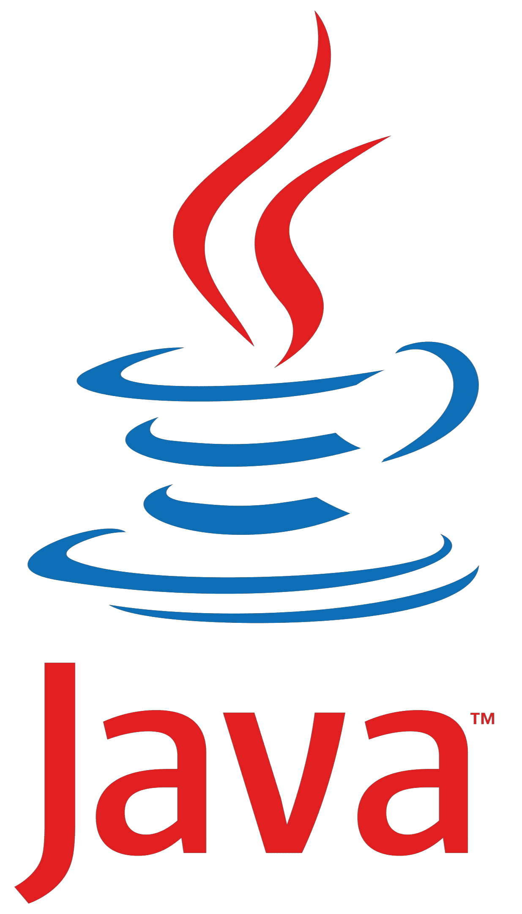
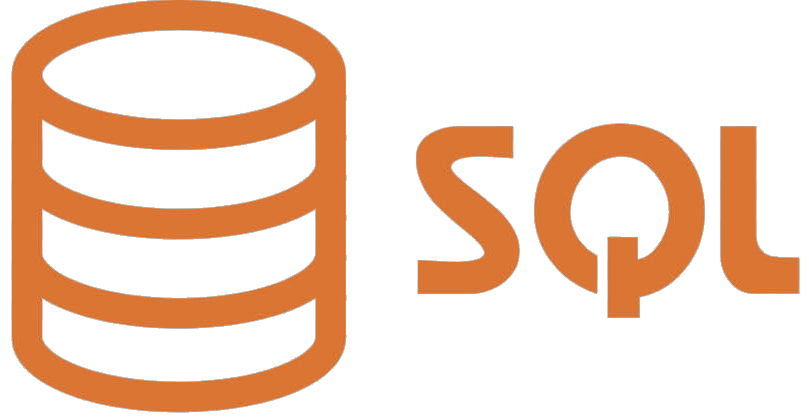

# Hi 👋 my name is Aliprandi Francesco

## Student & Developer

- 🌍 Milan - Italy.
- 🖥️ Click [here](https://aliprandi-francesco-portfolio.herokuapp.com) to see my portfolio (**offline**).
- 🚀 I'm currently learning cross-platform mobile development.
- 📫 Reach me at aliprandifrancescopp@gmail.com

## I regularly work with

## I also have worked/familiarity with

## Badges

